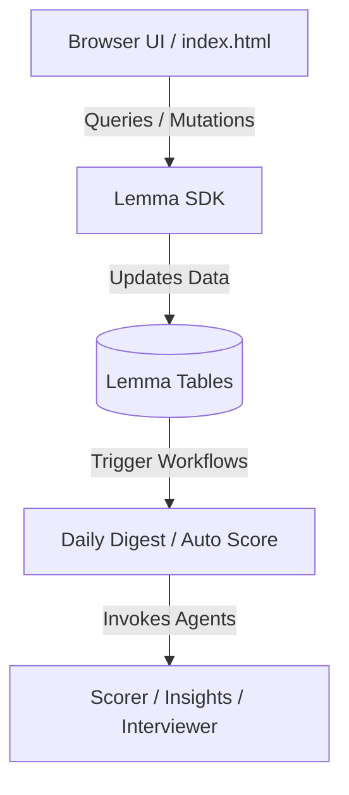

# ⚡ HireFlow · AI-Powered Hiring Pipeline

HireFlow is a premium, real-time recruiting and hiring platform built on top of the **Lemma SDK**. It uses advanced AI agent workflows to screen candidates in seconds, generate tailored interview kits instantly, and draft offer/rejection templates.

---

## 🚀 Key Features

*   🤖 **AI Resume Screening & Match Scoring**: Automatically parses and scores candidates out of 100% against job requirements.
*   📊 **Daily Digest Collaboration**: Daily summary of new candidates and stuck pipeline warnings.
*   🎯 **One-Click Interview Kits**: Generates culture-fit and technical questions tailored to the candidate's profile with suggested timeline schedules.
*   📄 **Resume Management & Downloads**: Download original resume files in their native binary formats (like PDF) or generate formatted PDF profiles instantly.
*   💫 **Premium UI/UX Layout**: Implements dynamic ambient light orbs, animated transitions, glassmorphic card grids, and responsive components.
*   ⚡ **Low-Latency Streaming**: AI Insights and Interview Kits stream in real-time as they generate with custom fallback mechanisms.

---

## 🛠️ Technology Stack & Language Breakdown

Calculated directly from codebase source code files:

<div style="display: flex; width: 100%; height: 28px; border-radius: 6px; overflow: hidden; font-family: sans-serif; font-size: 11px; font-weight: bold; color: white; text-align: center; line-height: 28px; margin: 15px 0; box-shadow: 0 4px 15px rgba(0,0,0,0.15);">
  <div style="width: 48.19%; background-color: #f1e05a; color: #111;" title="JavaScript: 48.19%">JS (48.2%)</div>
  <div style="width: 22.39%; background-color: #6366f1;" title="CSS: 22.39%">CSS (22.4%)</div>
  <div style="width: 19.83%; background-color: #e34c26;" title="HTML: 19.83%">HTML (19.8%)</div>
  <div style="width: 5.20%; background-color: #8b5cf6;" title="Markdown: 5.20%">MD (5.2%)</div>
  <div style="width: 4.39%; background-color: #10b981;" title="JSON: 4.39%">JSON (4.4%)</div>
</div>

| | Language / Filetype | Share (%) | Purpose |
| :---: | :--- | :--- | :--- |
| 🟡 | **JavaScript** | **48.19%** | Core frontend client logic, Lemma SDK connection, and real-time streaming polling |
| 🔵 | **CSS** | **22.39%** | Vanilla CSS styling, premium particle/glow keyframe animations, and custom print stylesheets |
| 🔴 | **HTML** | **19.83%** | Page structure, modal views, and interactive forms |
| 🟣 | **Markdown** | **5.20%** | AI Agent instructions and documentation |
| 🟢 | **JSON** | **4.39%** | Pod metadata, database schemas, and agent declarations |

## 🔒 Dual-Access Security & Guest Sandbox

To make review and evaluation seamless for hackathon judges, HireFlow provides two access pathways:
*   **⚡ Owner Access**: Authenticate securely using Lemma OAuth to view the live, production hiring pipeline database.
*   **🔍 Explore as Judge / Guest**: Bypasses authentication entirely to load a localized sandbox pre-seeded with **8 mock candidates** (complete with mock resumes, AI summaries, and match scores).
    *   **Data Isolation**: All modifications (moving candidate stages, adding positions, editing details, deleting records) reside purely in local browser memory.
    *   **Anti-Glitch Fallback**: If Lemma's AI server goes offline or returns errors, HireFlow intercepts them to output realistic simulated scores, insights, and kits, ensuring the evaluation is 100% bug-free.

---

## 📦 System Architecture



---

## ⚙️ Running Locally & Deploying

To import the pod configuration (tables, schemas, agents, workflows):
```bash
lemma pod import ./hireflow
```

To deploy the web application:
```bash
lemma apps deploy hireflow ./hireflow/apps/hireflow/index.html
```

---

*Built with ❤️ for the Gappy AI Hackathon using Lemma SDK & Cloud.*
