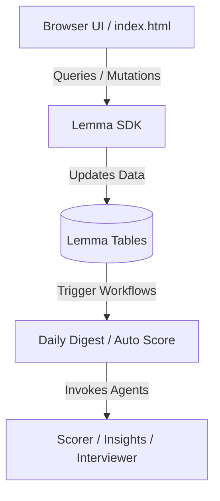

# ⚡ HireFlow · AI-Powered Hiring Pipeline

HireFlow is a premium, real-time recruiting and hiring platform built on top of the **Lemma SDK**. It uses advanced AI agent workflows to screen candidates in seconds, generate tailored interview kits instantly, and draft offer/rejection templates.

---

## 🚀 Key Features

*   🤖 **AI Resume Screening & Match Scoring**: Automatically parses and scores candidates out of 100% against job requirements.
*   📊 **Daily Digest Collaboration**: Daily summary of new candidates and stuck pipeline warnings.
*   🎯 **One-Click Interview Kits**: Generates culture-fit and technical questions tailored to the candidate's profile with suggested timeline schedules.
*   📄 **Resume Management & Downloads**: Download original resume files in their native binary formats (like PDF) or generate formatted PDF profiles instantly.
*   💫 **Premium UI/UX Layout**: Implements dynamic ambient light orbs, animated transitions, glassmorphic card grids, and responsive components.
*   ⚡ **Low-Latency Streaming**: AI Insights and Interview Kits stream in real-time as they generate with custom fallback mechanisms.

---

## 🛠️ Technology Stack & Language Breakdown

Calculated directly from codebase source code files:

| Language / Filetype | Share (%) | Purpose |
| :--- | :--- | :--- |
| **JavaScript** | **48.19%** | Core frontend client logic, Lemma SDK connection, and real-time streaming polling |
| **CSS** | **22.39%** | Vanilla CSS styling, premium particle/glow keyframe animations, and custom print stylesheets |
| **HTML** | **19.83%** | Page structure, modal views, and interactive forms |
| **Markdown** | **5.20%** | AI Agent instructions and documentation |
| **JSON** | **4.39%** | Pod metadata, database schemas, and agent declarations |

---

## 📦 System Architecture



---

## ⚙️ Running Locally & Deploying

To import the pod configuration (tables, schemas, agents, workflows):
```bash
lemma pod import ./hireflow
```

To deploy the web application:
```bash
lemma apps deploy hireflow ./hireflow/apps/hireflow/index.html
```

---

*Built with ❤️ for the Gappy AI Hackathon using Lemma SDK & Cloud.*
